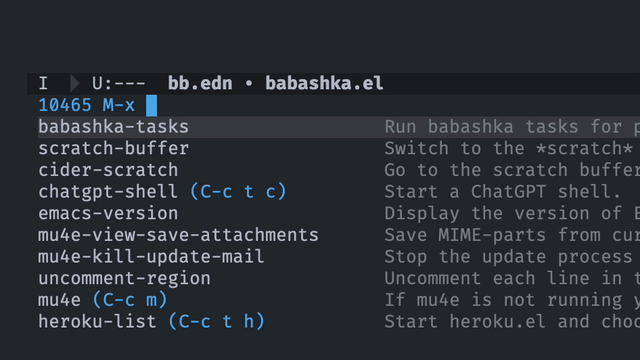
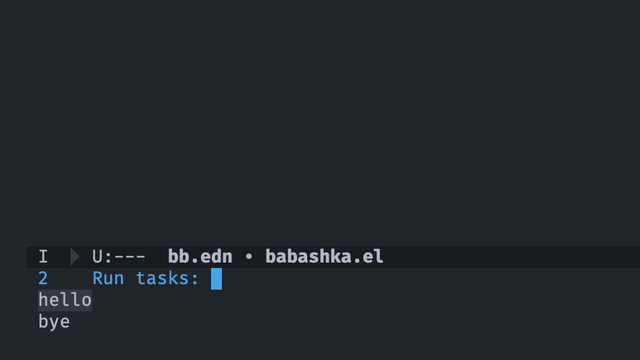
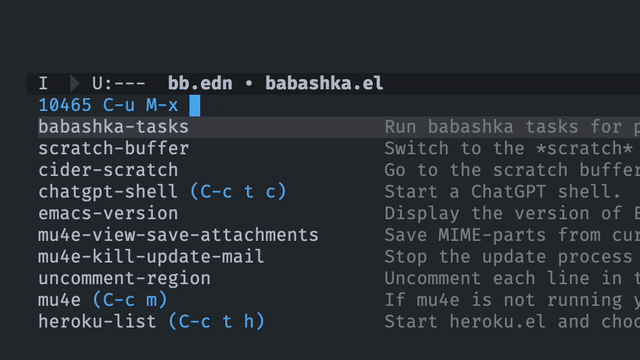
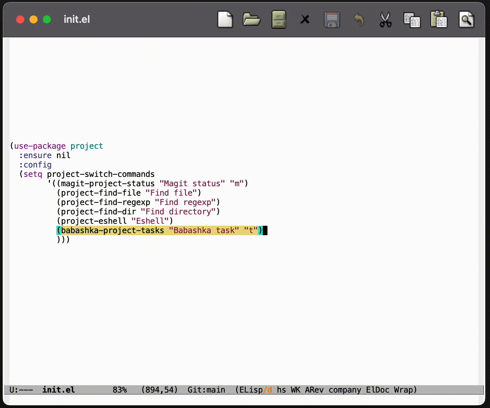

# babashka.el
Emacs interface for [babashka](https://babashka.org) tasks.

[](https://melpa.org/#/babashka)
[](https://stable.melpa.org/#/babashka)

## Usage

### Simply call a task
The main entry point is `babashka-tasks`. If called from a buffer visiting a file in a project with `bb.edn` in it, it will look up the directory tree recursively until `bb.edn` is found, parses it for tasks and offer a menu to select a task to run:



### Call a tasks with command line args
If your task accepts command line arguments, just type them after the task name:



### Call tasks from any directory
If you want to specify a `bb.edn` to run tasks from, simply call `babashka-tasks` with an interactive argument:

```
C-u M-x babashka-tasks RET
```



### Make it a `project-switch-project` action
`project-switch-project` can be extended with custom dispatch
actions. To add a dispatch action which runs a Babashka task from the
project's root, add `babashka-project-tasks` to your
`project-switch-commands` list. For example:
```elisp
(setq project-switch-commands
      '((babashka-project-tasks "Babashka task" "t") ;; <--
        (magit-project-status "Magit status" "m")
        (project-find-file "Find file")
        (project-find-regexp "Find regexp")
        (project-find-dir "Find directory")
        (project-eshell "Eshell")
        ))
```



## Installation
Babashka.el is available on [MELPA](https://melpa.org/#/babashka) and [MELPA Stable](https://stable.melpa.org/#/babashka) and can be installed with:

```
M-x package-install RET babashka RET
```

or using `use-package`:

```elisp
(use-package babashka)
```

## Versioning
The project uses [break versioning](https://github.com/ptaoussanis/encore/blob/master/BREAK-VERSIONING.md), meaning that upgrading from 1.0.x to 1.0.y will always be safe, upgrade to 1.y.0 might break something small, and upgrade to y.0.0. will break almost everything. That was a versioning spec in one sentence, by the way.

## Contributing
If you have more ideas about using babashka from Emacs — please submit a PR or a feature request.


